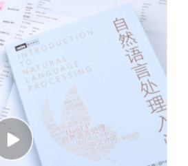

- [《自然语言处理入门》详细笔记](https://github.com/NLP-LOVE/Introduction-NLP)

- 机器学习与深度学习请转至本人项目：[ML-NLP](https://github.com/NLP-LOVE/ML-NLP)

- HanLP项目：[HanLP](https://github.com/hankcs/HanLP)

- 参考书目:

  > 何晗 [《自然语言处理入门》](http://nlp.hankcs.com/book.php)
  >
  > 


**NLP领域热门问题:**

(HanLP项目中的代码,并非教学专用,而是已经达到了生产级别的成熟代码,有着工业级开发经验的分享)

- 中文分词
- 词性标注
- 命名实体识别
- 信息抽取
- 文本聚类
- 文本分类
- 句法分析

**(读书时,时刻有 定位意识,知道自己在哪,每隔一个部分进行一次总结!无部分明显分割时,2页一总结;笔记上,每隔一部分,进行一次编排整理!)**


# Chapter 1 新手上路

- 自然语言,词汇量大,随意造次 含有不同的复杂的语义信息,适用于具体语境(中文这方面更明显)
- 自然语言 非结构性;编程语言 线性
- 自然语言 歧义
- 自然语言 容错性(错了要猜,错语言可能加入语料库) 易变性(可以自由创造和传播新用法) 简略性(省略常识或双方知道的信息)
- "**猜"**字贯串始终!


- 语音\图像 受限于存储容量和存储速度,他们的信息总量依旧没有文本多
- 我们倾向于把他们转化为 文本再进行接下来的处理


- **词法分析**:中文分词-->词性标注(词语类别&浅层歧义的消除)-->命名实体识别(较长的专有名词识别) 

  一步一步,中文分词是后续步骤的基础;中文分词 已经达到了工业使用的水准

  词法分析3个任务都是围绕词语进行的分析.词法分析后,文本已经呈现 **部分结构化**

- **文章级别进行:** (文本分类 与 文本聚类,属于两种截然不同的算法流派)

  - 文本分类 eg.一段话褒or贬 一封邮件是否是垃圾邮件
  - 文本聚类 eg.相似的文档聚在一起,or 排除 重复的文档


- **句法分析:**

  分析词语之间的关系

  eg.句法分析器的分析结果:(树形结构)

  


- 语义分析&篇章分析

  - 语义消歧
  - 语义角色标注
  - 语义依存分析

  难度上升,较为前沿的课题,未能达到实用的精确程度;研究资源稀缺,大众难以获取,本书中不会涉及


看到这,大抵明白了何谓NPL(计算机语言学(Computer Linguistics,viz CL),),**与语音识别方向**是不同的!

NPL,是偏向于文本语义的理解,存储正对自然语言文本的计算机科学,处理结果 常为:语义树形结构!


- 其他高级任务

  eg.自动问答(理解语言是回答的前提,NPL的一个应用方向)、自动摘要(为文章生成简短摘要)、机器翻译(一种语言到另一种语言)

  自动问答 & 机器翻译,是两大常用方向!

  注意，一般认为信息检索**(Information Retrieve，IR)**是区别于自然语言处理的**独立学科**，IR的目标是查询信息，而NLP的目标是理解语言。(但IR与NPL具有紧密联系,正对自然语言的IR需要先理解;而SQL中的检索,则不需要;IR检索的未必是语言,也能是 以图搜图,以曲搜曲,商品搜索...)

  

  

  算法(一些更加复杂的模型),算力(硬件计算力),算料(语料库规模)

  50年代,图灵提出图灵测试,为AI奠定标准;乔姆斯基语法;首个句法分析器(基于规则)

  -->80年代,**规则系统**,面向逻辑推理的编程语言(专家系统)

  -->90年代,统计学习方法(**机器学习**方法)兴起,语料库建设,大量机器学习的理论和应用,达到了革命性的实用水准

  -->2010年,神经网络(算力,算料增长 & **卷积神经网络**模型的提出)复兴,机器学习进入**深度学习**领域

  > 1958年就已经提出了能够模拟人类感知能力的神经网络模型: 著名的**感知机**,1989年就已经训练出了首个卷积深度学习网络模型,用于识别手写数字,
  >
  > 但是碍于算力(GPU),2010年后,才广泛应用(之前训练速度太慢,占用资源过多)
  
  纯纯的规则系统已经式微,除了一些简单任务外,专家系统已经落伍.现在更多的是统计学习方法,领域专家(语言学专家)所起的作用越来越小了,而实际运行的系统在预处理&后处理的部分仍会用到一些手写规则.本书介绍 :**统计为主,规则为辅**的NLP系统搭建
  
  统计为主,指的是机器学习方法,而非深度学习.本书中致力于介绍大量的机器学习算法与一些深度学习算法。
  
  ;事实上,书中给出了数据,**深度学习在CV领域成绩耀眼，但在NPL领域发力不大，前沿准确率依旧是传统模型取得**，一方面,深度学习依赖GPU,而GPU远贵与CPU(入门计算显卡就需5000yuan,入门级塔式服务器仅3000元,虚拟服务器每月仅50元);从性价比角度，反倒是传统的机器学习方法更适合中小企业。
  
  
  
  
  
  

1. **什么是机器学习**                                              
美国工程院院士 Tom Mitchell 给过一个更明确的定义，**机器学习**指的是计算机通过某项任务的经验数据提高了在该项任务上的能力。 
2. **模型** 

模型是对现实问题的数学抽象，由一个假设函数以及一系列参数构成。以下就是最简单的模型公式：
 

其中，w 和 b 是函数的参数，而 x 是函数的自变量。不过模型并不包括具体的自变量x，因为自变量是由用户输入的。自变量 x 是一个特征向量，用来表示一个对象的特征。 

3. **特征** 

- **特征**指的是事物的特点转化的数值。
- 如何挑选特征，如何设计特征模板，这称作**特征工程**。特征越多，参数就越多；参数越多，模型就越复杂。 
4. **数据集** 
样本的集合在机器学习领域称作**数据集**，在自然语言处理领域称作**语料库**。
5. **监督学习** 
如果数据集附带标准答案 y，则此时的学习算法称作**监督学习**。学习一遍误差还不够小，需要反复学习、反复调整。此时的算法是一种迭代式的算法，每一遍学习称作**一次迭代**。这种在有标签的数据集上迭代学习的过程称作**训练**。
6. **无监督学习** 
如果我们只给机器做题，却不告诉它参考答案，机器仍然可以学到知识吗？可以，此时的学习称作**无监督学习**，而不含标准答案的数据集被称作**无标注的数据集**。无监督学习一般用于聚类和降维，**降维**指的是将样本点从高维空间变换成低维空间的过程。 
7. **其他类型的机器学习算法** 
- **半监督学习**：如果我们训练多个模型，然后对同一个实例执行预测，会得到多个结果。如果这些结果多数一致，则可以将该实例和结果放到一起作为新的训练样本，用力扩充训练集。这样的算法被称为半监督学习。

  > 可以综合利用标注数据&丰富的未标注数据,正在成为热门的话题

- **强化学习**：现实世界中的事物之间往往有很长的因果链：我们要正确地执行一系列彼此关联的决策，才能得到最终的成果

  这类问题往往需要一边预测，一边根据环境的反馈规划下次决策。这类算法被称为强化学习
  
  > 一遍一边预测,一边根据预测的反馈规划下次决策,在涉及人机交互的问题上成果斐然,eg.自动驾驶,电子竞技(如下棋,吃鸡中的人机),问答系统
  
- 本书并不会深入这些前沿方向,但了解这些分支的存在,有助于构建完整的知识体系


------

# NLP(HanLP)在我们的导盲项目中的重点应用:


**场景:**

用户说话,识别之后,与后台"字典"进行匹配,词典里的词时固定的,我们不可能寄希望于 用户每次都能精准地说出"字典"里的词;

通过HanLP,进行

1. 地名识别

2. 关键词提取

3. 自动摘要(划掉)

4. 以及最重要的: 文本推荐

   ```
   /**
    * 文本推荐(句子级别，从一系列句子中挑出与输入句子最相似的那一个) 句子级别,当然也是适用于词语的!
    * @author hankcs
    */
   ```

   

