[toc]

# 写在前面

## 1. why?:为什么要选 计算机组成-结构化方法 ,其与常规高校教材的区别与优势

**常规高校教材知识结构(含NEU):**

*   [第一章 计算机系统概述](#)
*   *   [知识网图](#)
    *   [冯诺依曼机的特点：](#)
    *   [不同级别的语言：](#)
    *   [计算机的工作过程：](#)
    *   [计算机的性能指标：](#)
*   [第二章 数据的表示和运算](#)
*   *   [知识网图](#)
    *   [在计算机系统内部，所有信息都用二进制进行编码的原因有以下几点：](#)
    *   [有符号的机器表示](#)
*   [第三章 存储系统](#)
*   *   [知识网图](#)
    *   [DRAM刷新方式](#)
    *   [程序访问的局部性原理](#)
    *   [虚拟存储器程序的执行过程](#)
    *   [快表](#)
    *   [虚拟存储器与Cache的比较](#)
*   [第四章 指令系统](#)
*   *   [知识网图](#)
    *   [常见指令寻址方式的特点及适用情况：](#)
    *   [CISC与RISC特点](#)
    *   [与CISC相比，RISC的优点：](#)
*   [第五章 中央处理器](#)
*   *   [知识网图](#)
    *   [CPU的具体功能](#)
    *   [控制器的工作原理](#)
    *   [控制器的主要功能](#)
    *   [CPU的控制方式](#)
    *   [硬布线控制单元设计步骤：](#)
    *   [硬布线和微程序控制器的特点](#)
*   [第六章 总线](#)
*   *   [知识网图](#)
    *   [总线传输的4个阶段](#)
*   [第七章 输入/输出系统](#)
*   *   [知识网图](#)
    *   [程序查询方式的工作流程](#)
    *   [程序中断的作用](#)
    *   [中断处理流程](#)
    *   [DMA方式与中断方式的区别](#)

**本书结构**:

[TOC]

**优势:**

> 本书采用结构化方法来介绍计算机系统，书的内容完全建立在“计算机是由层次结构组成的，每层完成规定的功能”这一概念之上。作者对本版进行了彻底的更新，以反映当今最重要的计算机技术以及计算机组成和体系结构方面的最新进展。书中详细讨论了数字逻辑层、微体系结构层、指令系统层、操作系统层和汇编语言层，并涵盖了并行体系结构的内容
>
> 结构化是计算机组成知识体系的核心,该书契合七层结构中的底下几层,相比常见高校教材对计算机原理的直接分块阐述,该书分层深入阐述,更具体系化与结构化特征.对于网络原理的学习大有裨益.且网络中缺乏对该书的系统总结,因而成为我的首选.

## 2. how?:如何分析这种结构化分层结构,熟悉本书

> 该书正文有六大部分,其实可以分为两个大类，
>
> - 一是计算机网络和数据库；
> - 二是计算机组成、操作系统、算法、数据结构。

>  **计算机组成**告诉你**硬件能做什么**，
>
> **操作系统**告诉你它是如何管理这些硬件并提供给外部(上层)接口来使用。
>
> **算法和数据结构**告诉你如何高效、简洁的的使用这些接口以便达到最合理的使用硬件和尽可能的有利于软件开发。

>  一定要理解计算机系统设计的分类和分层(你理解了之后就会知道这句话是什么意思)〔不要对硬件细节抠的太仔细，一切都从整体来看〕。接着看操作系统原理，我认为操作系统的两大难点是
>
> - 虚拟内存管理、
> - 进程调度和通信，而且与编程关联比较密切。

> 本书采用结构化方法来介绍计算机系统，书的内容完全建立在“计算机是由层次结构组成的，每层完成规定的功能”这一概念之上。作者对本版进行了彻底的更新，以反映当今最重要的计算机技术以及计算机组成和体系结构方面的最新进展。书中详细讨论了
>
> - 数字逻辑层、
> - 微体系结构层、
> - 指令系统层、
> - 操作系统层
> - 汇编语言层
>
> 并涵盖了并行体系结构的内容，
>
> 而且每一章结尾都配有丰富的习题。
>
> 本书适合作为计算机专业本科生计算机组成与结构课程的教材或参考书，也可供相关领域技术人员参考

## 3.For What?: 结合高校机组原理要求掌握的知识体系,需要重点了解的知识点

1. 冯洛伊曼体系结构

2. 浮点数, 补码,移码

3. ALU,加法器,74181,74182芯片
4. 指令系统,指令组成,寻址方式
5. CPU,IR,PC,MAR,AR,PSW
6. 指令周期,超标量和流水线结构
7. 微程序,微指令
8. ROM,RAM,存储芯片,Cache

[^_^]: # (注释:以东北大学为代表)

# Chapter1:绪论

## 一. 计算机组成-结构化概述:

## 二.计算机系统组成:

- 上图:

- 计算机操作系统
  - 硬件
    - 主机
    - 外设
    - ......
  - 软件
    - 系统软件,eg.操作系统,DBMS(数据库管理系统),标准程序库(编程时会使用的一些库函数),网络软件(实现TCP,IP...协议的一些安全模块),语言处理程序(如高级语言的编译程序),服务程序(如debug程序)
    - 应用软件

- 计算机史:

  - 第一台电子计算机:ENIAC(电极管也即真空管,占地170㎡,1.8W电子管)
  - 
  - 贝尔实验室:肖克利:电子管(viz真空管),仙童半导体(Fairchild Semiconductor)公司发明集成电路,Bell :Intel,Sanders :AMD

- 内存

  - MAR(Memory Address Register)
  - MDR(Memory Data Register)

- 工作过程(取指,析指,执行)

  - 过程演示:[王道(分秒勿跳)](https://www.bilibili.com/video/BV1BE411D7ii?p=5)

  - 关键:

  - 冯洛伊曼机的相关硬件:

    

    (现代计算机中,MAR,MDR被集成到CPU里面)

    

# Chapter2:数据的表示与计算

- 上图:

  

---------

### 1. 十进制到任意进制

- 简单情况(整数部分靠近二进制数,小数部分容易看出)下用凑数法

   如利用二进制数表转换260.75,536.725

- 整数部分除积取整,小数部分乘积取余

  

### 2.BCD码(都是每四个二进制位对应1个十进制位,三种BCD码对6种冗余给出了不同解决方案)

- 8421码的加法演示(5+8 =13,0101 + 1000 = 1101,超出映射表,强制高位进1出现变为0001,而 1101+0110=0011;9+9 = 18,1001+1001=0001 0010,0010在映射表内,不需要+0110修正)

- 余三码

  

  5~9首位为1,避免二义,加法依权而定

### 3. 字符与字符串

- ASCII码

  - 表

  

  - 根据规律做题

    

- 汉字表示与编码

  

- 内存中字符串的存储及多字节数据(如汉字区内码)存储的大端模式&小端模式

  

### 4. 检验码

> 检验码知识难,该部分知识仅供摘抄重点供复习,出现疑问看不懂,移步:https://www.bilibili.com/video/BV1BE411D7ii?p=13

- 码距

  > 码距d=2时,具备检错能力,不能纠错,只能请求重新发送数据;
  >
  > d≥3时,在设计合理(比如Hamming码合理;循环冗余校验码在某些情况下合理,某些情况下有效信息码过多检验码过少,此时d≥3,也不能实现检错)  ==TODO:待添加链接==

- Hamming码求解(指1.求校验位,并利用模型2.检错,3.纠错)步骤:

  

  1. 学会海明码位数的校验码位数求解公式: 

     

     ,求出检验码位数k=3,海明码位数3+4=7

  2. 学会校验码求法:

     得出校验码分布后,进行分组,分别进行偶校验:

     

     (分组概念极为重要,参照韦恩图理解)

     3. 学会理解纠错原理,闪变位置(不考虑闪变2或多位)发生在不同位置时检验方程的偶校验结果(结合韦恩图),并根据结果找到闪变位置,进行纠错

     4. 补充:Hamming码无法检错2位及以上,引入`全位校验码`

        

        > 有两位错时纠正不了,只能请求重传

- 循环冗余校验码(CRC码)

  -  求CRC码

    

  - 相除步骤,模二除,模二减的引入,并得到余数(检验位)

    

    > 信息码+检验位=CRC码

  - 检错与纠错

    

    >  此处余数为010,出错但不能代表C2出错,因为此时有效信息位过多而检验码过少不能检验出具体错在哪一位(即不能纠错)
    >
    > 参见视频:https://www.bilibili.com/video/BV1BE411D7ii?p=13  17 :17

### 5. 原码反码补码移码

- 四码概览:

  

  > 由[X]补快速求[-X]补的方法:
  >
  > ​        符号位、数值位全部取反，末位+1

- 原码整数与小数的表示范围

  

  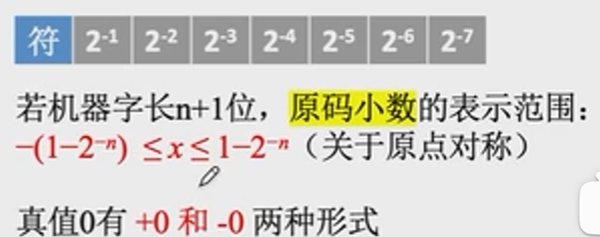

- 反码只是原码-->补码 的一个中间状态,并没有什么卵用

- 对正数:原码=反码=补码

  对负数:补码=反码 末位+1(注意进位的处理)

  > 注意负数0的补码与正数0的补码重合,及空缺下来的 1,000 0000&1.000 0000的表示值重新定义
  >
  > 

- 移码:补码基础上符号位取反,仅用于表示正数

  用途:

  利用移码`方便真值的大小比较`(移码后面比较大小会特别常用)

  

- 溢出判断:

  [王道考研-溢出判断](https://www.bilibili.com/video/BV1BE411D7ii?p=17)

### 6.算数移位(比逻辑移位,循环移位更常考)

- 原码的反码:符号位不参与移位,左移右移都补0,正数的原码,反码,补码都如此
- 负数的反码,左移右移都补1
- 负数的补码:右移补1,左移补0

> 反码的算数移位定义基于原码的移位的反码,补码的算数移位基于原码的移位的补码

- 

  

### 原码的乘法

----

----

# Chapter 3:存储系统

- 上图:

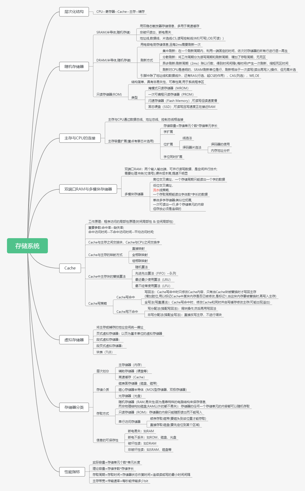

----

## 1. 主存简单模型与寻址概念

- 存储芯片的结构与物理实现:

  

  学会解释译码器作用,寻址,读/写操作在电路层面的实现

- 寻址

  

  > 该存储矩阵中一个存储单元代表1Byte=8bit,一行有4个存储单元,字长为4Byte;
  >
  > 处于一行的4个存储单元可以同时接入一条数据线
  >
  >  
  >
  > 不同寻址方式(以java为例,按字节:Boolean,按字: int ,按半字:short,按双字:long)可以划分出不同多个内存单元 

  

## 2. 半导体存储器RAM(易失性,断电消失)

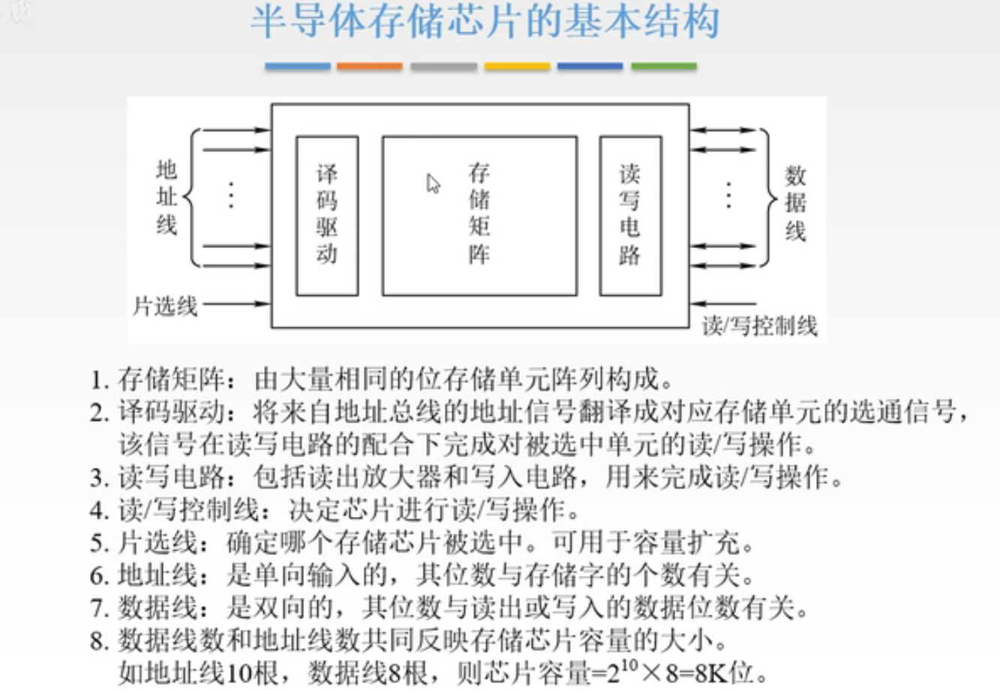

- 半导体存储芯片的基本结构(几根数据线则可进行几位数据的传输,线数即位数)

  

  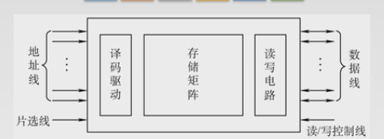

  > 1. 存储矩阵:有大量相同的为存储单元阵列构成
  > 2. 译码驱动:将来自地址总线的地址信号翻译成对应存储单元的选通信号(如0000 0001经过译码驱动,告知需要选中第0行,第一列的存储单元 ),
  > 3. 读写电路:,包括放大器和写入电路,完成读/写
  > 4. 读写控制线:控制芯片进行读写操作
  > 5. 片选线:确定那个存储芯片被选(即控制存储芯片的开关)中,只有一根线所以只能传送一位数据;多组芯片同时开关,也可以轮流开关
  > 6. 地址线:单向输入,64位计算机,则有64根地址线
  > 7. 数据线:双向,位数与读入或写入数据的数据位数有关(代表了计算机芯片能一次同时处理多少位)
  > 8. 数据线与地址线数共同反映存储芯片容量大小,如地址线:32根,数据线8根,芯片容量二的八次方Byte

  

- SRAM与DRAM(现在已经改进为了SDRAM)

  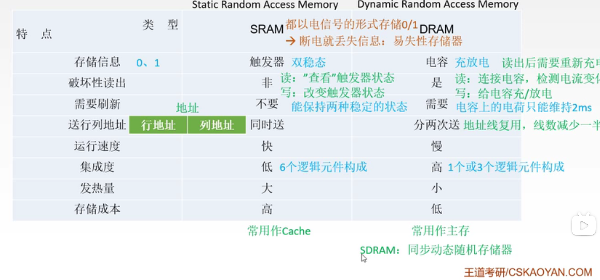

  > DRAM需要每隔2ms刷新一次,为此速度慢(每次刷新相当于一次读写,一次刷新所需时间=一次读写所需时间)

- DRAM的刷新

  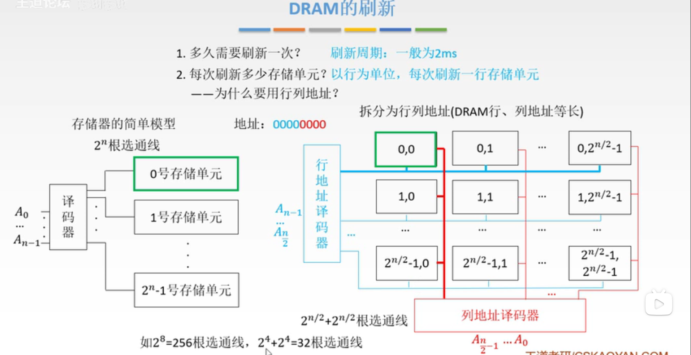

  > 拆分为行列地址的优势:节省选通线

  - 刷新时间,实现与三种刷新模式:

    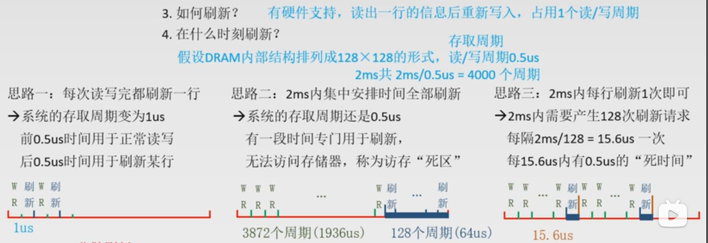

## 3. 半导体存储器ROM----非易失性

- ROM具有非易失性,初始发明的ROM只能读,不能写,所以叫ROM,但现在多数ROM能读能写,但依旧无法完全替代RAM(速度,容量,成本)

- 分类

  

SSD正在不断向RAM靠近,ROM掉电不易失,将来可能替代RAM

## 4. 主存与CPU的连接

- 主存容量拓展--位拓展(8K×1-->8K×2,)

  

  

- 主存容量拓展--字拓展

  - 线选法(01-->10,有地址空间浪费,不连续)

  
  - 译码器片选法(该图中非门属于简单的译码器;图右展现了高电平选片信号时工作的译码器,另有低电平...)

    

  - 线选法与译码器片 关键区别:

    - 与地址线的连接----决定芯片是否同时工作,同时输出数据
    - 与数据线的连接----决定输出数据的位数

    

    

- 字位同时拓展

  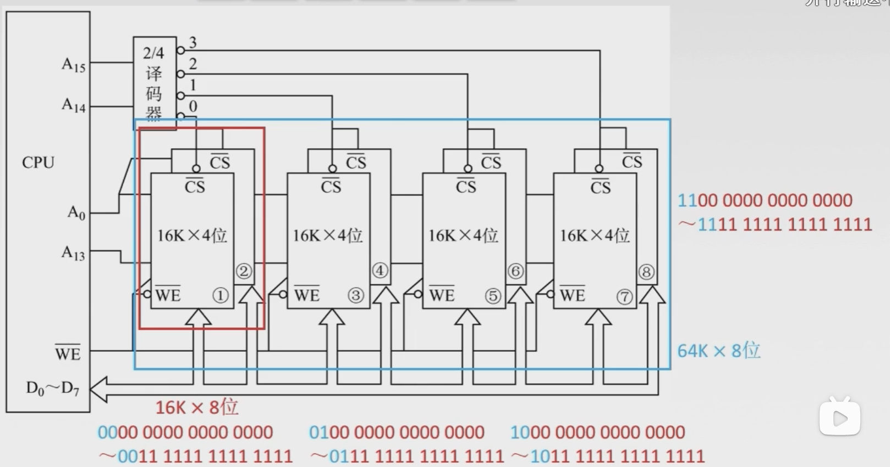

`黄色箭头所指部分:疑惑点,低电平有效?非门?`

## 5. 双口RAM和多模块存储器

- 单体多字存储器 与 多体并行存储器

  

- `高位交叉编址` 与 `低位交叉编址`

  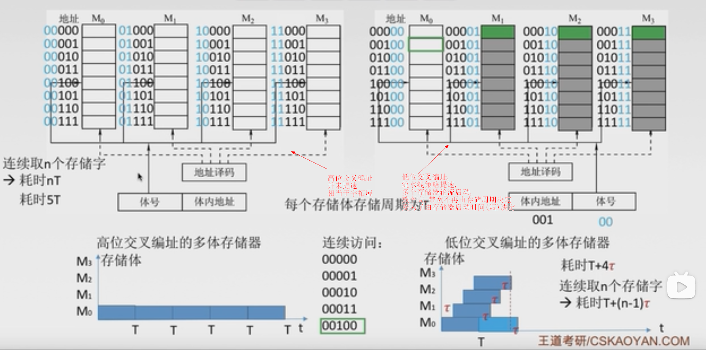

  > 高位交叉编址相当于字拓展,并不能提速
  >
  > 低位交叉编址采用了流水线策略,多个存储器轮流启动,带宽不再由存储器存取周期(长)决定,而变成了由存储器启动时间(短)决定

- 低位交叉编址流水线策略中,模块数m,启动时间r 与带宽的关系图解:

  

- m<T/R,需要等待,每个流水周期多等待时间r;

  m＞T/R,存储体有轮空,有效率浪费

- 流水线耗时的微观计算 与 宏观计算(n极大时的估算)

  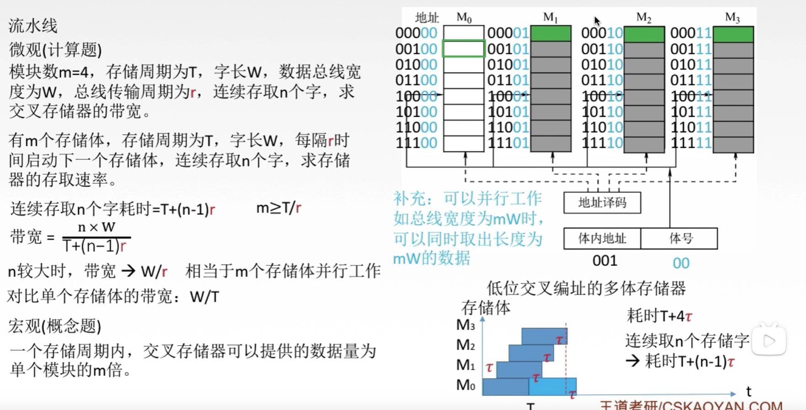

## 6. Cache的引入----局部性原理

- 低位交叉存储提速n倍后,CPU与主存 速度差距依然很大-->引入更复杂的电路设计提速--导致-->高速存储单元价格↑,容量↓-->局部性原理
- 三种映射方式:
  - 全相联映射----最简单,空位随意放(由替换策略决定)
  - 直接映射----复杂,对号入座,`无所谓替换策略?`
  - 组相联映射---复杂,对号入组,组内随意放(由替换策略决定)

- Cache工作原理:

  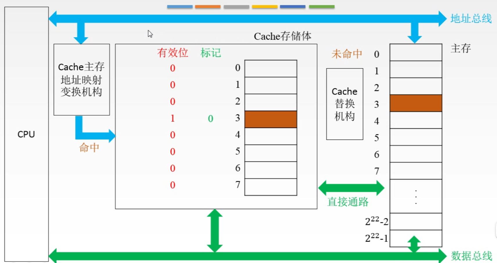

- Cache容量的计算:

  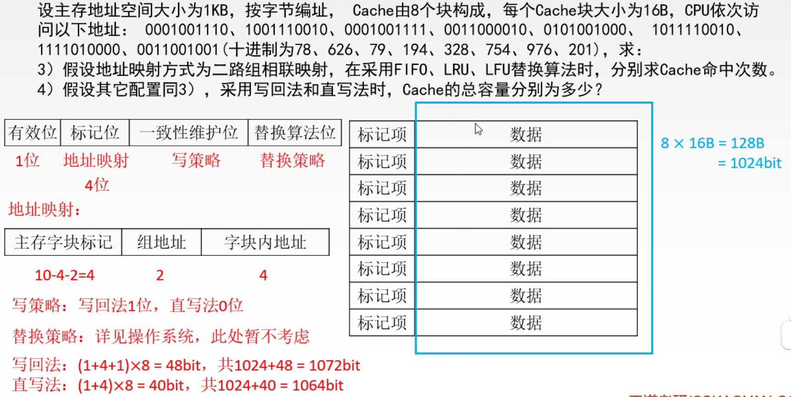

### 7. 虚拟内存

- 

----

---

# Chapter4:指令系统与寻址

- 上图

## 1. 拓展操作码

- 设计要求:断码不能是长码的前缀;指令使用频率高,尽量分派短的操作码(同哈夫曼编码)

- 操作码的预留:

  

- 地址码

  

  > ACC----累加器

- 边界对齐:

  

> 这也算边界对齐!

- 三个`字长`:

| 机器字长 | CPU一次能处理的二进制数据的位数    |
| -------- | ---------------------------------- |
| 指令字长 | 一个指令字中包含的二进制代码的位数 |
| 储存字长 | 一个存储单元存储二进制代码的长度   |

> 单字长指令:指令长度=机器字长
>
> 半字长指令,双字长指令...此时三个字长之间没有必然关系

## 2. 寻址

-  指令寻址的 顺序寻址&跳跃寻址

- 

  

  

- 

# Chapter2:计算机系统组成

# Chapter3:数字逻辑层

# Chapter4:微体系结构层z

# Chapter5:指令系统层

# Chapter6:操作系统层

# Chapter7:汇编语言层

# 跋(写在后面&总结)

